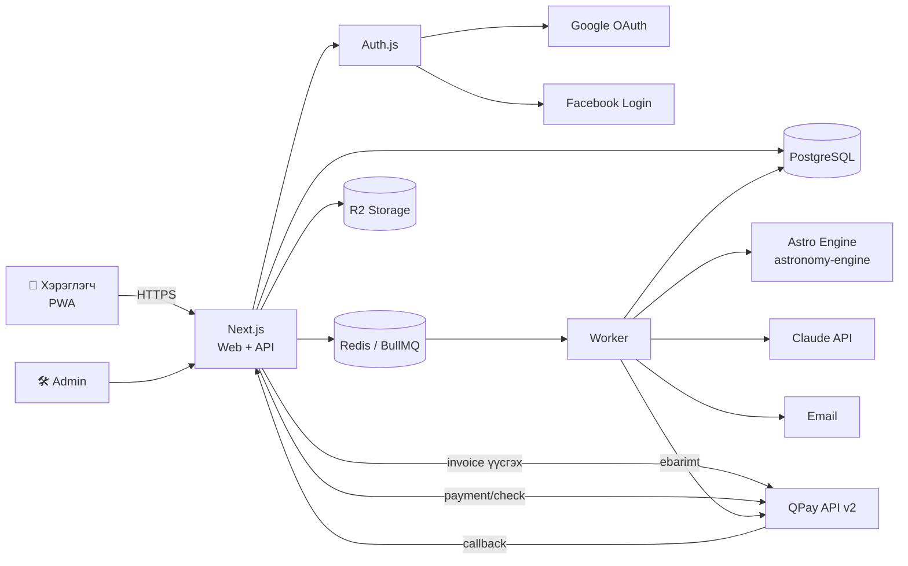

# Зурхайн Web App — Системийн архитектур ба бүтээгдэхүүний бүтэц

> Хувилбар 0.1 · 2026-09-30 · Mobile-first PWA

---

## 1. Зах зээлийн судалгаа: ижил төстэй app-уудаас авах сургамж

| App | Гол онцлог | Бидэнд авах санаа |
|---|---|---|
| **Co–Star** | Натал карт, найзаа нэмж харьцуулах, өдөр бүрийн push | "Найзаа нэмээд нийцлээ хар" нь вирал өсөлтийн гол хөдөлгүүр болсон. Харин хэт олон upsell push хэрэглэгчийг залхаадаг — push-ийг өдөрт 1-ээс хэтрүүлэхгүй. |
| **The Pattern** | "Bond" — ээж, найз, хамт ажиллагч, хайртай хүнтэй харилцааны шинжилгээ | Харилцааны **төрлөөс** хамаарч өөр тайлбар гаргадаг. Ээжтэй хийх нийцэл ≠ хайртай хүнтэй хийх нийцэл. |
| **Nebula** | Хоёр хүний натал картыг бүтнээр нь харьцуулсан нарийвчилсан нийцэл | Төрсөн **цаг, газар** оруулбал илүү нарийвчлалтай. Долоо хоногийн subscription-ыг ил тод бус харуулдаг гэж шүүмжлэл авдаг — бид үнийг үргэлж тод харуулна. |
| **Sanctuary / CHANI** | Өдрийн үнэгүй зурхай + төлбөртэй гүн контент | Үнэгүй өдрийн контент нь хэрэглэгчийг өдөр бүр буцааж авчирдаг (retention). |
| **Монголын зурхайн сайт, сонины булан** | 12 жилийн амьтан, өдрийн сайн/муу үйл (үс засуулах, хол явах) | Монгол хэрэглэгч 12 жил, мэнгэ, өдрийн сайн цагийн зурхайд их итгэдэг. Барууны 12 ордтой **хослуулах** нь өрсөлдөхөд давуу тал болно. |

**Дүгнэлт — сайн туршлагууд:**
1. **Эхний үнэ цэнийг үнэгүй өг.** Бүртгүүлмэгц өөрийн өдрийн зурхай, орд, 12 жилээ харуулна.
2. **Paywall-д урьдчилан харах хэсэг.** Эхний 1–2 догол мөрийг үнэгүй харуулж, үлдсэнийг бүдгэрүүлнэ (blur). Энэ нь худалдан авалт хийх магадлалыг хамгийн их нэмэгдүүлдэг арга.
3. **Хуваалцах карт.** Үр дүнг Instagram/FB story хэмжээтэй (9:16) зураг болгон хуваалцах.
4. **Харилцааны төрлөөс хамаарсан контент.** Ээж/аав дээр секс, болзооны зурхай санал болгохгүй.
5. **Үнэ ил тод байх.** Нуугдмал subscription байхгүй. Хэтэвчний үлдэгдэл үргэлж харагдана.

---

## 2. ⚠️ Дутуу, орхигдсон зүйлс (санал)

### 2.1 Өгөгдлийн хувьд
| # | Асуудал | Санал |
|---|---|---|
| 1 | **Төрсөн цаг, газар байхгүй.** Натал карт (өгсөх орд, 12 гэр, Сарны байрлал) цаг болон газаргүйгээр тооцогдохгүй. | "Төрсөн цаг (заавал биш)", "Төрсөн газар (хот/аймаг)" талбар нэмэх. Мэдэхгүй бол 12:00 гэж тооцоод "нарийвчлал багассан" гэж анхааруулна. |
| 2 | **Хүйс байхгүй.** Хайр дурлал, секс зурхайн текстийг зөв бичихэд хэрэгтэй. | Хүйс (эр / эм / хэлэхгүй) талбар нэмэх. |
| 3 | **Нас байхгүй.** Секс зурхай 18+ контент. | Төрсөн огноогоор 18 наснаас доош бол секс зурхайг хааж, хэрэглэгч өөрөө 18+ гэдгээ баталгаажуулна. |
| 4 | **Харилцааны төрөл болон бүтээгдэхүүний уялдаа** тодорхойгүй. | Бүтээгдэхүүн бүрт `allowed_relations` тодорхойлох (хүснэгт 4.2-г үз). |

### 2.2 Бүтээгдэхүүний хувьд
| # | Асуудал | Санал |
|---|---|---|
| 5 | **"Төрсөн өдрийн зурхай" гэдэг нь яг юу вэ?** Төрөлхийн (натал) шинжилгээ үү, эсвэл төрсөн өдрөөс хойших 1 жилийн таамаг уу? | Хоёуланг нь тусад нь санал болгох боломжтой: *Төрөлхийн зурхай* (нэг удаа, үүрд) ба *Жилийн таамаг* (жил бүр шинэчлэгдэнэ). |
| 6 | **Худалдаж авсан зурхай хэр удаан хүчинтэй вэ?** | Натал төрлийнх: **үүрд** хадгалагдана. Хугацаатай (сар/жил): тухайн хугацаанд. Энэ нь давтан орлогын эх үүсвэр болно. |
| 7 | **Үнэгүй контент байхгүй.** Хэрэглэгч буцаж ирэх шалтгаангүй. | **Өдрийн зурхай** (үнэгүй), **Монгол зурхай** (12 жил, өдрийн сайн үйл) нэмэх. |
| 8 | **Багц үнэ байхгүй.** | "Бүгдийг нээх" багц (жишээ нь 5 зурхай = 5,000₮ оронд 4,000₮). |
| 9 | **Урамшуулал, промо код, найз урих урамшуулал** байхгүй. | Найзаа урьж тэр нь цэнэглэвэл хоёуланд нь 500₮ бонус олгох. |
| 10 | **Нийцлийг хоёр тал харах уу?** | Урьсан хүн бүртгүүлбэл худалдаж авсан нийцлийг хоёулаа харах боломжтой байх — вирал өсөлтөд тусална. |

### 2.3 Төлбөр, хуулийн хувьд
| # | Асуудал | Санал |
|---|---|---|
| 11 | **И-баримт (НӨАТ)** дурдагдаагүй. Монголд заавал. | Цэнэглэлт бүрт QPay-ийн ebarimt API-гаар баримт үүсгэнэ. Хэрэглэгчээс хувь хүн эсвэл байгууллагын регистр авах. |
| 12 | **Гар утсан дээр QR уншуулах боломжгүй.** Хэрэглэгч өөрийн утасны дэлгэц дээрх QR-ыг уншуулж чадахгүй. | QPay invoice-ийн хариунд ирэх **банкны апп-ын deeplink** жагсаалтыг (Хаан, Голомт, ТДБ, Хас…) товч болгон харуулна. QR-ыг зөвхөн desktop-д харуулна. |
| 13 | **Буцаан олголт (refund)** бодлого байхгүй. | Зурхай үүсгэх явцад алдаа гарвал **автоматаар** хэтэвчинд буцаана. Хэтэвчний үлдэгдлийг бэлнээр буцаах эсэхийг Үйлчилгээний нөхцөлд тодорхой бичнэ. |
| 14 | **Хамгийн бага цэнэглэлт, бонус** | Сонголттой дүн: 2,000 / 5,000 (+300) / 10,000 (+1,000) / 20,000 (+3,000). |
| 15 | **Хувь хүний мэдээлэл.** Бусдын төрсөн өдөр, имэйлийг тэдний зөвшөөрөлгүй хадгалж байна. | Хувь хүний мэдээлэл хамгаалах тухай хуулийн (2021) дагуу: Нууцлалын бодлого, зөвшөөрлийн checkbox, урьсан хүн өөрийн мэдээллийг устгах эрхтэй байх. |
| 16 | **"Зөвхөн зугаа цэнгэлийн зорилготой"** гэсэн анхааруулга | Footer болон зурхай бүрийн доор байршуулна. |

### 2.4 Техникийн хувьд
| # | Асуудал | Санал |
|---|---|---|
| 17 | **Facebook/Messenger-ийн in-app browser дотор Google нэвтрэлт ажилладаггүй** (Google webview-ийг хориглодог: `disallowed_useragent`). Монголд траффикийн ихэнх нь FB-ээс орж ирнэ. | In-app browser-ийг илрүүлээд "Browser-т нээх" заавар харуулах. Тэр үед Facebook login-ыг гол сонголт болгоно. |
| 18 | **Facebook Login-д шаардлага бий:** App Review, Business verification, Privacy Policy URL, **Data Deletion Callback**. | Эхэнд нь бэлдэх. Нөөц болгож **имэйл OTP** нэвтрэлт нэмэх. |
| 19 | **Нэг хүн Google болон FB-ээр тусад нь нэвтэрвэл** хоёр данс үүснэ. | Ижил баталгаажсан имэйлтэй бол дансыг нэгтгэх (account linking). |
| 20 | **Урих суваг зөвхөн имэйл.** Монголчууд имэйлээс илүү Messenger ашигладаг. | **Урих линк** үүсгэж Messenger/Viber-ээр хуваалцах. Имэйл нь нэмэлт сонголт. |
| 21 | **Админ самбар** байхгүй. | Хэрэглэгч, гүйлгээ, гар аргаар буцаалт хийх, үнэ өөрчлөх, промо код, контентын загвар, статистик. |
| 22 | **Зурхайн текстийг хэн/юу бичих вэ?** | Одон орны тооцоо + AI (LLM) + редакцийн загвар (5-р хэсгийг үз). |

---

## 3. Бүтээгдэхүүний бүтэц (Information Architecture)

### 3.1 Доод навигаци (Mobile tab bar)

```
┌─────────────────────────────────────────┐
│  ☀ Өнөөдөр │ 👥 Хүмүүс │ ✨ Зурхай │ 👤 Би │
└─────────────────────────────────────────┘
       Хэтэвчний үлдэгдэл: header-т үргэлж харагдана  [💰 3,500₮ +]
```

| Таб | Агуулга |
|---|---|
| **Өнөөдөр** | Өөрийн өдрийн зурхай (үнэгүй), Монгол зурхай (өдрийн сайн үйл), хамаатай хүмүүсийн мини карт, "Та ээжтэйгээ нийцлээ хараагүй байна" гэх мэт санал |
| **Хүмүүс** | Би + хамаатай хүмүүсийн жагсаалт (avatar, нэр, орд, 12 жил), **+ Хүн нэмэх** |
| **Зурхай** | Бүтээгдэхүүний каталог + **Миний зурхайнууд** (худалдаж авсан сан) |
| **Би** | Профайл, хэтэвч ба гүйлгээний түүх, и-баримт, тохиргоо, мэдэгдэл, устгах/экспорт |

### 3.2 Гол урсгалууд

**A. Onboarding (≤ 60 секунд)**
```
Landing → Google / Facebook нэвтрэх → Нэр, төрсөн огноо (+ цаг, газар, хүйс — заавал биш)
→ 🎁 Шууд: "Таны орд: Хилэнц ♏ · Жил: Морь 🐎" + өнөөдрийн зурхай (үнэгүй)
→ "Ээж, найз, хайртай хүнээ нэмэх үү?" (алгасаж болно)
```

**B. Хүн нэмэх**
```
+ Хүн нэмэх → Харилцаа сонгох (Ээж, Аав, Найз, Хайрт, Краш, Ах/Эгч, Хамт ажиллагч, Бусад)
→ Avatar сонгох (бэлэн сан) → Нэр, төрсөн огноо (+цаг, газар, хүйс)
→ [ ] Урих (имэйл эсвэл линк хуулах)  → Хадгалах
```

**C. Зурхай худалдаж авах (гол орлогын урсгал)**
```
Бүтээгдэхүүн сонгох
  → Хүн сонгох (харилцааны төрлөөр шүүгдсэн) / + шинэ хүн
  → Урьдчилан харах (эхний догол мөр + blur)
  → [Нээх · 1,000₮]  Үлдэгдэл: 3,500₮ → 2,500₮
       ├─ Үлдэгдэл хүрэлцэнэ → Шууд хасаад → "Зурхай бэлтгэж байна…" (5–20 сек) → Үр дүн
       └─ Хүрэлцэхгүй → Цэнэглэх bottom sheet → QPay → буцаж ирээд автоматаар худалдан авалт үргэлжилнэ
  → Хуваалцах карт үүсгэх / Хадгалагдана (Миний зурхайнууд)
```

**D. Хэтэвч цэнэглэх (QPay)**
```
Дүн сонгох → Backend: QPay invoice үүсгэнэ
  → Утсан дээр: банкны апп-уудын жагсаалт (deeplink) · Desktop дээр: QR
  → Хэрэглэгч банкны апп-д төлнө
  → QPay → callback → backend: payment/check-ээр баталгаажуулна → хэтэвч +дүн (+бонус) → и-баримт
  → Frontend: SSE/polling-оор "Амжилттай!" гэж харуулна
```

---

## 4. Бүтээгдэхүүний тодорхойлолт

### 4.1 Каталог

| Код | Нэр | Үнэ | Төрөл | Хүмүүс | Хугацаа |
|---|---|---|---|---|---|
| `daily` | Өдрийн зурхай | Үнэгүй | тооцоо + загвар | 1 | өдөр бүр |
| `mongol_daily` | Монгол зурхай (өдрийн сайн үйл) | Үнэгүй | хуанли | — | өдөр бүр |
| `natal` | Төрсөн өдрийн (төрөлхийн) зурхай | 2,000₮ | AI | 1 | үүрд |
| `sign` | Ордны зурхай | 1,000₮ | AI | 1 | үүрд |
| `love` | Хайр дурлалын зурхай | 1,000₮ | AI | 1 | үүрд |
| `sex` 🔞 | Секс зурхай | 1,000₮ | AI | 1 | үүрд |
| `dating` | Болзооны зурхай | 1,000₮ | AI | 1 | сар* |
| `synastry` | Нийцлийн зурхай | 1,000₮ | AI | 2 | үүрд |
| `bundle_all` | Бүгдийг нээх (санал) | 4,000₮ | багц | 1 | — |
| `year_ahead` | Жилийн таамаг (санал) | 3,000₮ | AI | 1 | 1 жил |

\* Болзооны зурхайг сар бүр шинэчлэгддэг болговол давтан худалдан авалт бий болно.

### 4.2 Харилцааны төрөл × Бүтээгдэхүүн

| Харилцаа | natal | sign | love | sex | dating | synastry-ийн хэлбэр |
|---|---|---|---|---|---|---|
| Би | ✅ | ✅ | ✅ | ✅ 18+ | ✅ | — |
| Хайрт / Краш | ✅ | ✅ | ✅ | ✅ 18+ | ✅ | 💞 Хайрын нийцэл |
| Найз | ✅ | ✅ | ✅ | ❌ | ❌ | 🤝 Нөхөрлөлийн нийцэл |
| Ээж / Аав / Ах / Эгч | ✅ | ✅ | ❌ | ❌ | ❌ | 🏠 Гэр бүлийн нийцэл |
| Хамт ажиллагч | ✅ | ✅ | ❌ | ❌ | ❌ | 💼 Ажлын нийцэл |

Нийцлийн зурхай нь нэг бүтээгдэхүүн боловч харилцааны төрлөөс хамаарч **өөр prompt/загвар** ашиглана.

---

## 5. Зурхайн контент үүсгэх Engine

```
 Төрсөн өгөгдөл ──► [1. Тооцооллын давхарга] ──► chart JSON ──► [2. Тайлбарын давхарга] ──► Монгол текст
 (огноо, цаг,        astronomy-engine                 (гариг, орд,       LLM + редакцийн загвар
  газар, цагийн бүс)  гариг, гэр, аспект               гэр, аспект)       + бүтэцтэй гаралт (JSON)
```

1. **Тооцоо (детерминистик):** Гаригуудын байрлал, өгсөх орд, гэр, аспектуудыг код дээр тооцно. LLM-ээр **тооцоо хийлгэхгүй** — алдаа гаргадаг.
   - Номын сан: `astronomy-engine` (MIT лиценз). ⚠️ *Swiss Ephemeris нь AGPL эсвэл төлбөртэй лицензтэй — хаалттай арилжааны кодод ашиглах бол лиценз худалдаж авна.*
   - Монгол зурхай: 12 жилийн амьтан, мэнгэ, суудал, билгийн тооллын хуанлийг тусдаа модуль болгоно.
2. **Тайлбар (AI):** chart JSON + бүтээгдэхүүний загвар + харилцааны төрөл → LLM (жишээ нь Claude Sonnet) → хэсгүүдэд хуваагдсан JSON (`summary`, `sections[]`, `advice`, `share_quote`).
   - Системийн prompt-д: Монгол хэлний найруулга, өнгө аяс, хориглох сэдэв (эрүүл мэнд, санхүүгийн шийдвэр, үхэл), "зугаа цэнгэлийн" хүрээ.
   - **Кэш:** `hash(product + chart_input + relation + prompt_version)` түлхүүрээр. Ижил өгөгдөлтэй хоёр дахь худалдан авалт шууд, үнэгүй (LLM зардалгүй) гарна.
   - Өдрийн зурхай: хүн бүрт биш, **12 орд × өдөр** бүрээр cron-оор өглөө бүр урьдчилан үүсгэнэ → зардал бараг тэг.
3. **Чанарын хяналт:** Эхний 100 гаралтыг хүн уншиж шалгах. Prompt-ын хувилбарыг (`prompt_version`) хадгалж A/B туршина.

---

## 6. Системийн архитектур

### 6.1 Технологийн сонголт

| Давхарга | Сонголт | Шалтгаан |
|---|---|---|
| Frontend | **Next.js (App Router) + TypeScript + Tailwind**, PWA | SSR → FB/Google-д хуваалцахад OG зураг зөв гарна. PWA → нүүр дэлгэцэд суулгах, web push |
| UI | shadcn/ui + Framer Motion | Mobile bottom sheet, хурдан хөгжүүлэлт |
| Auth | **Auth.js (NextAuth)** — Google, Facebook, Email OTP | Account linking, session |
| Backend | Next.js Route Handlers (эхэнд монолит) | Нэг deploy, энгийн. Өсвөл worker-ийг салгана |
| DB | **PostgreSQL** + Drizzle/Prisma ORM | Хэтэвч = санхүүгийн өгөгдөл → ACID transaction зайлшгүй |
| Queue | **Redis + BullMQ** | AI үүсгэлт, и-баримт, имэйлийг background-д |
| Storage | S3-тэй нийцтэй (Cloudflare R2) | Avatar, хуваалцах карт |
| OG/Share зураг | `@vercel/og` (Satori) | 9:16 story карт |
| Email | Resend / AWS SES | Урилга, баримт |
| AI | Anthropic Claude API | Монгол хэлний чанар сайн, бүтэцтэй гаралт |
| Төлбөр | **QPay Merchant API v2** + ebarimt | Монголын стандарт |
| Хостинг | VPS/Docker (Singapore эсвэл Tokyo бүс), эсвэл Монголын дата төв | Монгол руу бага latency. QPay callback-д тогтмол HTTPS хаяг |
| Хяналт | Sentry, PostHog (analytics + funnel), Uptime monitor | |

### 6.2 Бүтцийн диаграм



### 6.3 Folder бүтэц (санал)

```
horoscope/
├─ apps/web/                  # Next.js
│  ├─ app/
│  │  ├─ (public)/            # landing, нэвтрэх, нөхцөл, нууцлал
│  │  ├─ (app)/today|people|readings|me|wallet
│  │  ├─ admin/
│  │  ├─ invite/[token]/
│  │  └─ api/
│  │     ├─ auth/[...nextauth]/
│  │     ├─ qpay/callback/
│  │     ├─ fb/data-deletion/
│  │     └─ readings/[id]/stream/   # SSE
│  └─ components/
├─ packages/
│  ├─ db/          # schema, migrations
│  ├─ astro/       # тооцооллын engine (барууны + монгол)
│  ├─ ai/          # prompt-ууд, загварууд, хувилбарууд
│  ├─ payments/    # QPay client, ebarimt, ledger
│  └─ shared/      # төрөл, бүтээгдэхүүний каталог
└─ apps/worker/    # BullMQ worker
```

---

## 7. Өгөгдлийн сангийн схем

```sql
users            (id, email, name, avatar_id, locale, is_18_confirmed, created_at, deleted_at)
auth_accounts    (id, user_id, provider, provider_account_id, UNIQUE(provider, provider_account_id))

-- "Би" ч мөн person бичлэг (is_self = true) → бүх логик нэг загвараар ажиллана
persons          (id, owner_user_id, is_self, relation_type, name, avatar_id,
                  birth_date, birth_time NULL, birth_time_known,
                  birth_place_id NULL, lat, lng, tz, gender NULL,
                  linked_user_id NULL,         -- урьсан хүн бүртгүүлбэл холбогдоно
                  created_at, deleted_at)
avatars          (id, url, category)
invitations      (id, person_id, inviter_user_id, channel[email|link], email NULL,
                  token_hash, status[pending|accepted|expired|revoked], expires_at)

products         (code PK, name, price, person_count, allowed_relations[], age_restricted,
                  validity[forever|month|year], is_active, sort)
product_prices   (id, product_code, price, valid_from)  -- үнийн түүх

-- Хэтэвч: DOUBLE-ENTRY-д ойр LEDGER. balance-ийг зөвхөн transaction-оор өөрчилнө
wallets          (user_id PK, balance BIGINT CHECK (balance >= 0), updated_at)
wallet_entries   (id, user_id, type[topup|bonus|purchase|refund|promo|adjust],
                  amount,            -- +/-
                  balance_after, ref_type, ref_id, idempotency_key UNIQUE, created_at)

topups           (id, user_id, amount, bonus, status[pending|paid|expired|failed],
                  qpay_invoice_id UNIQUE, qpay_payment_id, paid_at,
                  ebarimt_id NULL, ebarimt_type[person|org], ebarimt_reg_no NULL)

purchases        (id, user_id, product_code, price_paid,
                  person_a_id, person_b_id NULL,
                  input_snapshot JSONB,        -- худалдаж авах үеийн төрсөн өгөгдөл
                  reading_id NULL, status[pending|generating|done|failed|refunded],
                  valid_until NULL, created_at)

readings         (id, cache_key UNIQUE, product_code, relation_type, chart JSONB,
                  content JSONB, model, prompt_version, lang, created_at)

daily_horoscopes (date, sign, content JSONB, PRIMARY KEY(date, sign))
promo_codes      (code, bonus_amount, max_uses, used_count, expires_at)
referrals        (inviter_user_id, invitee_user_id, rewarded_at)
audit_logs       (id, actor_id, action, entity, entity_id, data JSONB, created_at)
```

**Чухал дүрмүүд:**
- Мөнгөн дүнг `BIGINT` (төгрөг) хадгалах. `float` хэзээ ч ашиглахгүй.
- Худалдан авалт: нэг DB transaction дотор `SELECT … FOR UPDATE` wallet → үлдэгдэл шалгах → хасах → `wallet_entries` + `purchases` бичих.
- `input_snapshot`: хэрэглэгч дараа нь төрсөн огноог засвал хуучин зурхай өөрчлөгдөхгүй.

---

## 8. QPay төлбөрийн найдвартай байдал

1. **Invoice үүсгэх:** `sender_invoice_no = topup.id`, `callback_url = /api/qpay/callback?topup=<id>&sig=<HMAC>`.
2. **Callback-д итгэхгүй:** Callback ирэхэд QPay-ийн `payment/check`-ээр төлөгдсөн эсэх, дүн таарч байгааг **заавал дахин шалгана**.
3. **Idempotency:** `topups.status = 'paid'` бол дахин кредит нэмэхгүй (`idempotency_key = qpay_payment_id`).
4. **Callback ирэхгүй тохиолдол:** Frontend 3 сек тутам `/topups/:id` шалгах + backend-д 2 минут тутам pending invoice-уудыг шалгах cron.
5. **Токен:** QPay access token-ыг Redis-д кэшлэж, хугацаа дуусахаас өмнө шинэчлэнэ.
6. **И-баримт:** Төлбөр баталгаажмагц queue-ээр үүсгэнэ. Алдаа гарвал retry хийж, админд мэдэгдэнэ.
7. **Эвлэрүүлэлт (reconciliation):** Өдөр бүр QPay-ийн гүйлгээний жагсаалтыг `topups`-тай тулгана.

---

## 9. Аюулгүй байдал ба нууцлал

- Нэвтрэлт: HttpOnly, Secure, SameSite cookie. CSRF хамгаалалт.
- Эрхийн шалгалт: `persons.owner_user_id = session.user_id`. Бусдын хүний ID-г таах боломжгүй (UUID) бөгөөд сервер дээр заавал шалгана.
- Урилгын токеныг hash хэлбэрээр хадгална, 7 хоногийн хугацаатай.
- Rate limit: нэвтрэлт, invoice үүсгэх, AI үүсгэх endpoint-ууд.
- Хэрэглэгч **өөрийн өгөгдлөө устгах, татаж авах** боломжтой байх. FB Data Deletion callback.
- Урьсан хүн "намайг устгаач" гэвэл тухайн `persons` бичлэг устгагдана.
- Нууц түлхүүрүүдийг (QPay, Claude, OAuth) зөвхөн env/secret manager-т хадгална.

---

## 10. Mobile-first UX зарчмууд

- Дизайныг **360–390px** өргөнөөс эхэлж зурна. Том товч (≥44px), эрхий хуруунд хүрэх доод хэсэгт гол үйлдэл.
- Сонголт, цэнэглэлт, хүн нэмэхийг **bottom sheet**-ээр хийнэ (шинэ хуудас руу үсрэхгүй).
- Огноо оруулах: Монгол хэрэглэгчид ойлгомжтой "Он / Сар / Өдөр" гурван scroll picker (native date picker утас бүрт өөр харагддаг).
- Төрсөн газар: Монголын 21 аймаг + УБ-ын дүүргүүд + дэлхийн хотуудын autocomplete (координат, цагийн бүсийн хамт).
- AI үүсгэлтийн 5–20 секундийн хүлээлтийг гоё анимаци болон текстийг хэсэг хэсгээр (streaming) харуулж нөхнө.
- Харанхуй (dark) горимыг анхнаас нь хийх — зурхайн app-д одтой харанхуй дэвсгэр тохиромжтой.
- Lighthouse Performance ≥ 90, эхний ачаалал < 2 сек (3G/4G).

---

## 11. Хэмжих үзүүлэлтүүд (KPI)

| Funnel | Үзүүлэлт |
|---|---|
| Landing → Бүртгэл | % |
| Бүртгэл → Эхний хүн нэмсэн | % (вирал индикатор) |
| Бүртгэл → Эхний цэнэглэлт | % (conversion) |
| Цэнэглэлтийн дундаж дүн | ₮ |
| D1 / D7 / D30 retention | % |
| Урилга → Бүртгэл (K-factor) | коэффициент |
| Нэг зурхайн AI зардал vs үнэ | margin |

---

## 12. Хөгжүүлэлтийн үе шат (Roadmap)

| Үе | Хугацаа (ойролцоо) | Хамрах хүрээ |
|---|---|---|
| **0. Бэлтгэл** | 1–2 долоо хоног | Компани/merchant бүртгэл, QPay гэрээ, и-баримт, FB App Review, Нууцлалын бодлого, Үйлчилгээний нөхцөл, контентын өнгө аяс |
| **1. MVP** | 4–6 долоо хоног | Google/FB нэвтрэлт, профайл, хүн нэмэх + avatar, өдрийн зурхай (үнэгүй), 3 бүтээгдэхүүн (natal, sign, synastry), хэтэвч + QPay, Миний зурхайнууд, энгийн админ |
| **2. Өсөлт** | 3–4 долоо хоног | Бусад бүтээгдэхүүн (love, sex 18+, dating), урих линк/имэйл, хуваалцах карт, промо код, багц, бонус |
| **3. Retention** | 3–4 долоо хоног | Монгол зурхай, web push, жилийн таамаг, сар бүрийн болзооны зурхай, referral урамшуулал |
| **4. Цаашид** | — | Subscription (Premium), native app (Capacitor / React Native), хэрэглэгч хоорондын нийцлийн "Bond", астрологичтой чатлах |

---

## Эх сурвалж
- [Co–Star (App Store)](https://apps.apple.com/app/id1264782561)
- [Bustle — Pattern vs Co–Star comparison](https://www.bustle.com/life/pattern-co-star-astrology-apps-comparison)
- [Co-Star, Sanctuary, Pattern, Nebula, Stellium ranked 2026](https://unstar.app/vi/blog/co-star-sanctuary-pattern-nebula-stellium-astrology-apps-ranked-2026)
- [Best astrology apps 2026 comparison](https://bmcks-apps.onrender.com/blog/best-astrology-apps-2026)
- [QPay Node.js SDK (@mnpay/qpay)](https://npmjs.com/package/@mnpay/qpay)
- [QPay Python client — API (Монгол)](https://qpay-client.readthedocs.io/mn/latest/api.html)
- QPay developer портал: https://developer.qpay.mn
