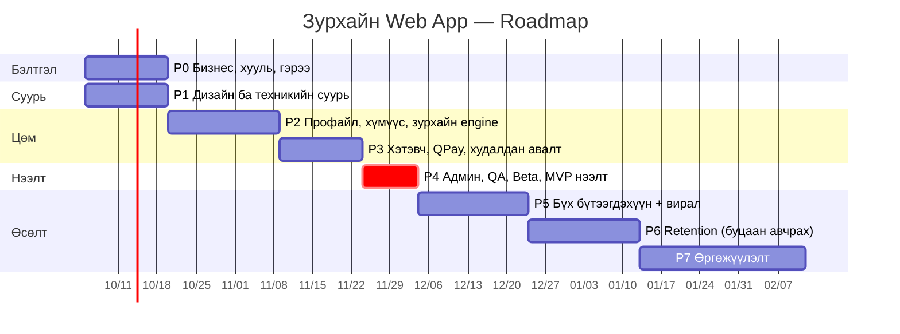

# Зурхайн Web App — Төслийн төлөвлөгөө (Phase-ууд)

> Хувилбар 0.1 · 2026-09-30 · Архитектур: [ARCHITECTURE.md](ARCHITECTURE.md)

---

## 0. Таамаглал ба багийн бүрэлдэхүүн

| Үүрэг | Товчлол | Ачаалал |
|---|---|---|
| Бүтээгдэхүүн эзэмшигч (та) | **PO** | Шийдвэр, бизнес, хууль, контентын чиглэл |
| Full-stack хөгжүүлэгч | **DEV** | 1 хүн (2 хүн бол хугацаа ~35% богиносно) |
| UI/UX дизайнер | **DES** | Phase 1-д бүтэн цагаар, дараа нь хагас цагаар |
| Контент / зурхайч редактор | **CNT** | Prompt, загвар, AI гаралтыг шалгах (хагас цаг) |
| Тестер | **QA** | Phase 4-өөс (эсвэл DEV + PO хийнэ) |

- Хугацааг **ажлын өдөр (ө)** гэж тооцсон. 1 долоо хоног = 5 ажлын өдөр.
- Нийт хугацаа: **MVP нээлт хүртэл ~12 долоо хоног**, бүрэн хувилбар хүртэл ~20 долоо хоног.
- ⚠️ **Шүүмжлэлтэй зам (critical path):** QPay merchant гэрээ, и-баримт, Facebook App Review нь гадны байгууллагаас хамаардаг бөгөөд хамгийн удаан явдаг. Эдгээрийг **эхний өдөр** эхлүүлнэ.

---

## Ерөнхий хуваарь

| Phase | Нэр | Хугацаа | Үр дүн (Milestone) |
|---|---|---|---|
| **P0** | Бизнес, хууль, гэрээ | 3 д.х (P1-тэй зэрэг) | QPay, и-баримт, FB App бэлэн. Бүх хууль эрх зүйн баримт бичиг |
| **P1** | Дизайн ба техникийн суурь | 3 д.х | Figma дизайн, repo, CI/CD, DB, нэвтрэлт ажиллана |
| **P2** | Профайл, хүмүүс, зурхайн engine | 4 д.х | Хүн нэмэх, үнэгүй өдрийн зурхай, AI зурхай үүсгэх |
| **P3** | Хэтэвч, QPay, худалдан авалт | 3 д.х | Цэнэглээд зурхай худалдаж авах бүтэн урсгал |
| **P4** | Админ, QA, Beta → **MVP нээлт** 🚀 | 2 д.х | Олон нийтэд нээгдэнэ |
| **P5** | Бүх бүтээгдэхүүн + вирал өсөлт | 4 д.х | 6 бүтээгдэхүүн, урилга, хуваалцах карт, промо |
| **P6** | Retention | 4 д.х | Монгол зурхай, push, давтан худалдан авалт |
| **P7** | Өргөжүүлэлт | 6+ д.х | Subscription, native app, шинэ боломжууд |

---

## P0 — Бизнес, хууль, гэрээ (PO) · 7–15 ө · P1-тэй зэрэг

> Зорилго: Техникийн ажлыг гадны хүлээлтээс болж зогсохгүй байлгах.

| ID | Ажил | Хариуцагч | Хугацаа | Хамаарал | Дууссаны шалгуур |
|---|---|---|---|---|---|
| P0-01 | Хуулийн этгээд (ХХК) болон дансаа бэлтгэх | PO | — | — | Гэрчилгээ, банкны данс |
| P0-02 | **QPay merchant гэрээ** хийж, sandbox + production түлхүүр авах | PO | 5–15 ө | P0-01 | `client_id`, `client_secret`, `invoice_code` авсан |
| P0-03 | **И-баримт** бүртгэл (ТТГ), QPay ebarimt-ийг идэвхжүүлэх | PO | 5–10 ө | P0-01 | Туршилтын баримт хэвлэгдсэн |
| P0-04 | Домэйн нэр авах (жишээ нь `zurhai.mn`), имэйл домэйн (SPF/DKIM) | PO | 1 ө | — | DNS тохирсон |
| P0-05 | Google Cloud OAuth client + consent screen | DEV | 1 ө | P0-04 | Баталгаажсан (verified) consent screen |
| P0-06 | **Meta (Facebook) App** үүсгэх, Business verification | PO/DEV | 5–15 ө | P0-04, P0-07 | Live горимд шилжсэн |
| P0-07 | **Үйлчилгээний нөхцөл, Нууцлалын бодлого**, 18+ бодлого, буцаалтын бодлого | PO (+хуульч) | 3–5 ө | — | Нийтлэгдэх URL бэлэн |
| P0-08 | Хувь хүний мэдээлэл хамгаалах хуулийн шаардлагыг шалгах | PO | 2 ө | P0-07 | Шалгах хуудас (checklist) |
| P0-09 | Үнэ, бонус, багц, хүчинтэй хугацааг эцэслэх | PO | 1 ө | — | `products` хүснэгтийн эцсийн утга |
| P0-10 | Anthropic API данс, төлбөрийн хязгаар тогтоох | DEV | 0.5 ө | — | API түлхүүр, зардлын дээд хязгаар |
| P0-11 | Брэнд: нэр, лого, өнгө, өнгө аяс (tone of voice) | PO/DES | 3 ө | — | Брэндийн хуудас |

**✅ Эхлэхээс өмнө PO-ийн гаргах шийдвэрүүд** (Phase 1-ийн эхний долоо хоногт):
- [ ] "Төрсөн өдрийн зурхай" = төрөлхийн шинжилгээ үү, жилийн таамаг уу?
- [ ] Зурхай бүрийн хүчинтэй хугацаа (үүрд / сар / жил)
- [ ] Цэнэглэлтийн хамгийн бага дүн, бонусын шатлал
- [ ] Хэтэвчний үлдэгдлийг бэлнээр буцаах эсэх
- [ ] Барууны зурхай + Монгол зурхай хоёуланг нь MVP-д оруулах уу? (Санал: MVP-д зөвхөн 12 жилийн амьтныг профайл дээр харуулах)

---

## P1 — Дизайн ба техникийн суурь · 15 ө (3 д.х)

> Зорилго: Дизайн батлагдаж, хөгжүүлэлтийн орчин бүрэн ажилладаг болох. Хэрэглэгч нэвтэрч чаддаг байх.

### 1A. UX/UI дизайн (DES)
| ID | Ажил | Хугацаа | Дууссаны шалгуур |
|---|---|---|---|
| P1-01 | User flow зураглал: onboarding, хүн нэмэх, худалдан авах, цэнэглэх | 2 ө | PO баталсан |
| P1-02 | Wireframe (гар утас 375px) — бүх MVP дэлгэц | 3 ө | ~20 дэлгэц |
| P1-03 | Design system: өнгө (dark/light), фонт (кирилл дэмждэг), товч, карт, bottom sheet | 3 ө | Figma component сан |
| P1-04 | Avatar сан (≥ 24 ширхэг: хүйс, нас, амьтан, орд) | 3 ө | SVG/PNG export |
| P1-05 | Hi-fi дизайн + prototype | 4 ө | Clickable prototype |
| P1-06 | 5 хүнээр prototype тестлэх, засах | 2 ө | Тестийн тэмдэглэл, засвар |

### 1B. Техникийн суурь (DEV)
| ID | Ажил | Хугацаа | Хамаарал | Дууссаны шалгуур |
|---|---|---|---|---|
| P1-10 | Monorepo (pnpm + Turborepo): `apps/web`, `apps/worker`, `packages/*` | 1 ө | — | `pnpm dev` ажиллана |
| P1-11 | Next.js + TS + Tailwind + shadcn/ui, ESLint/Prettier | 1 ө | P1-10 | — |
| P1-12 | PostgreSQL + ORM, migration, seed (products, avatars) | 2 ө | P1-10 | Схем (ARCHITECTURE §7) бүрэн |
| P1-13 | Docker Compose (Postgres, Redis) — локал орчин | 0.5 ө | — | Нэг командаар асна |
| P1-14 | Staging + Production сервер, HTTPS, env/secret удирдлага | 2 ө | P0-04 | `staging.` домэйн ажиллана |
| P1-15 | CI/CD (GitHub Actions): lint, typecheck, test, auto-deploy | 1 ө | P1-14 | PR бүр дээр шалгалт |
| P1-16 | **Auth.js: Google + Facebook** нэвтрэлт, session | 2 ө | P0-05, P0-06 (dev mode) | Хоёулаа ажиллана |
| P1-17 | Ижил имэйлтэй дансыг нэгтгэх (account linking) | 1 ө | P1-16 | Тест бичигдсэн |
| P1-18 | **In-app browser илрүүлэх** (FB, Messenger, Instagram) → "Browser-т нээх" заавар | 1 ө | P1-16 | Messenger дээр тестэлсэн |
| P1-19 | Sentry + PostHog холбох | 0.5 ө | P1-11 | Алдаа, event ирнэ |
| P1-20 | PWA: manifest, icon, service worker (offline shell) | 1 ө | P1-11 | "Нүүр дэлгэцэд нэмэх" ажиллана |
| P1-21 | Layout: bottom tab bar, header (хэтэвчний үлдэгдэл), dark mode | 2 ө | P1-03 | — |

**🏁 P1 Milestone:** Staging орчинд Google/FB-ээр нэвтэрч, хоосон 4 таб бүхий app-ийг утсан дээр харж болно.

---

## P2 — Профайл, хүмүүс, зурхайн engine · 20 ө (4 д.х)

> Зорилго: Хэрэглэгч бүртгүүлж, хүмүүсээ нэмээд, **үнэгүй** өдрийн зурхайгаа хардаг болох. AI зурхай үүсгэх pipeline ажилладаг болох (төлбөргүйгээр).

### 2A. Профайл ба хүмүүс
| ID | Ажил | Хугацаа | Хамаарал | Дууссаны шалгуур |
|---|---|---|---|---|
| P2-01 | Onboarding: нэр, төрсөн огноо (Он/Сар/Өдөр picker), цаг (мэдэхгүй сонголттой), газар, хүйс | 3 ө | P1-21 | ≤ 60 сек-д дуусна |
| P2-02 | Төрсөн газрын өгөгдөл: 21 аймаг + УБ-ын дүүргүүд + дэлхийн томоохон хотууд (lat/lng/tz) | 1 ө | — | Autocomplete ажиллана |
| P2-03 | Onboarding-ийн дараах "шууд бэлэг" дэлгэц: орд, 12 жилийн амьтан | 1 ө | P2-10 | — |
| P2-04 | **Хүмүүс** таб: жагсаалт (avatar, нэр, харилцаа, орд) | 1 ө | P1-21 | — |
| P2-05 | Хүн нэмэх/засах/устгах bottom sheet: харилцаа, avatar, мэдээлэл | 2 ө | P2-04, P1-04 | Эрхийн шалгалттай |
| P2-06 | Хүний дэлгэрэнгүй хуудас: мэдээлэл + тухайн хүнд боломжтой зурхайнууд | 1 ө | P2-05 | — |
| P2-07 | "Би" таб: профайл засах, гарах, **данс устгах** | 1 ө | P2-01 | Устгахад бүх өгөгдөл устана |

### 2B. Зурхайн engine (`packages/astro`)
| ID | Ажил | Хугацаа | Хамаарал | Дууссаны шалгуур |
|---|---|---|---|---|
| P2-10 | Нарны орд, 12 жилийн амьтан (Цагаан сараар тооцох), махбод | 1 ө | — | Unit test, хил дээрх огноонууд |
| P2-11 | Натал карт: гаригуудын байрлал, өгсөх орд, 12 гэр, аспектууд (`astronomy-engine`) | 4 ө | — | Лавлах сайтуудтай 10 кейсээр тулгасан |
| P2-12 | Synastry (хоёр картын аспект), нийцлийн оноо | 2 ө | P2-11 | Unit test |
| P2-13 | Өдрийн транзит (өдрийн зурхайд) | 1 ө | P2-11 | — |

### 2C. AI контент (`packages/ai`) — DEV + CNT
| ID | Ажил | Хугацаа | Хамаарал | Дууссаны шалгуур |
|---|---|---|---|---|
| P2-20 | Контентын өнгө аяс, хориглох сэдвүүд, бүтцийн загвар (CNT) | 2 ө | P0-11 | Баримт бичиг |
| P2-21 | Prompt-ууд: `daily`, `natal`, `sign`, `synastry` (+ харилцааны 4 хэлбэр) | 3 ө | P2-20 | JSON schema-тай гаралт |
| P2-22 | BullMQ worker: үүсгэх job, retry, timeout, кэш (`cache_key`) | 2 ө | P1-13 | Давхар үүсгэхгүй |
| P2-23 | **Өдрийн зурхай cron:** өглөө бүр 12 орд × 1 өдөр | 1 ө | P2-22 | 06:00-д бэлэн |
| P2-24 | Зурхай унших дэлгэц: хэсгүүд, streaming/анимаци, "зугаа цэнгэлийн" анхааруулга | 2 ө | P1-05 | — |
| P2-25 | Чанарын шалгалт: 50+ гаралтыг CNT уншиж засах → prompt v2 | 3 ө | P2-21 | ≥ 90% "хэвлэж болохуйц" |
| P2-26 | **Өнөөдөр** таб: өөрийн өдрийн зурхай + хүмүүсийн мини карт | 1 ө | P2-23 | — |

**🏁 P2 Milestone:** Хэрэглэгч бүртгүүлээд өдрийн зурхайгаа үзэж, хүн нэмж чадна. Админ/тестийн горимд төлбөргүйгээр натал болон нийцлийн зурхай үүсгэж болно.

---

## P3 — Хэтэвч, QPay, худалдан авалт · 15 ө (3 д.х)

> Зорилго: **Мөнгө орж ирдэг бүтэн урсгал.** Энэ phase-ийн алдаа шууд санхүүгийн алдагдал болно — тестийг хамгийн нарийн хийнэ.

| ID | Ажил | Хугацаа | Хамаарал | Дууссаны шалгуур |
|---|---|---|---|---|
| P3-01 | `packages/payments`: QPay client (token кэш, invoice create/get/cancel, payment/check) | 2 ө | P0-02 (sandbox) | Sandbox дээр ажиллана |
| P3-02 | Ledger: `wallets` + `wallet_entries`, `credit()`/`debit()` функцууд (`FOR UPDATE`, idempotency) | 2 ө | P1-12 | Зэрэгцээ тест (100 давхар хүсэлт) |
| P3-03 | Цэнэглэх bottom sheet: дүнгийн сонголт + бонус | 1 ө | P1-05 | — |
| P3-04 | **Утсан дээр банкны апп-уудын deeplink товчнууд**, desktop дээр QR | 1 ө | P3-01 | iOS + Android дээр тестэлсэн |
| P3-05 | Callback endpoint: HMAC шалгах → `payment/check` → credit → idempotent | 1 ө | P3-01, P3-02 | Давхар callback → нэг л кредит |
| P3-06 | Frontend polling/SSE "Төлбөр хүлээж байна…" → амжилттай | 1 ө | P3-05 | — |
| P3-07 | Pending invoice-уудыг 2 мин тутам шалгах cron | 0.5 ө | P3-05 | Callback-гүйгээр кредит орно |
| P3-08 | **И-баримт** үүсгэх (хувь хүн / байгууллага), хэрэглэгчид харуулах | 2 ө | P0-03, P3-05 | Баримтын дугаар харагдана |
| P3-09 | Худалдан авах урсгал: бүтээгдэхүүн → хүн сонгох (харилцаагаар шүүсэн) → preview (blur) → баталгаажуулах | 2 ө | P2-24 | — |
| P3-10 | Үлдэгдэл хүрэлцэхгүй → цэнэглээд **автоматаар үргэлжлэх** | 1 ө | P3-06, P3-09 | — |
| P3-11 | Үүсгэх үед алдаа гарвал **автоматаар буцаан олгох** | 0.5 ө | P2-22, P3-02 | Тест бичигдсэн |
| P3-12 | "Миний зурхайнууд" сан (хүнээр/төрлөөр шүүх) | 1 ө | P3-09 | — |
| P3-13 | Хэтэвч: үлдэгдэл, гүйлгээний түүх, баримтууд | 1 ө | P3-02 | — |
| P3-14 | Өдөр тутмын эвлэрүүлэлт (QPay ↔ `topups`) + зөрүүг админд мэдэгдэх | 1 ө | P3-05 | — |

**🏁 P3 Milestone:** Production QPay дээр жинхэнэ 100₮-өөр цэнэглээд зурхай худалдаж авах, и-баримт авах бүтэн урсгал ажиллана.

---

## P4 — Админ, QA, Beta → MVP нээлт 🚀 · 10 ө (2 д.х)

| ID | Ажил | Хариуцагч | Хугацаа | Дууссаны шалгуур |
|---|---|---|---|---|
| P4-01 | Админ: хэрэглэгч хайх, хэтэвч/гүйлгээ харах, **гар аргаар кредит/буцаалт** (audit log-той) | DEV | 2 ө | Зөвхөн админ эрхтэй |
| P4-02 | Админ: бүтээгдэхүүн, үнэ идэвхжүүлэх/унтраах | DEV | 1 ө | — |
| P4-03 | Админ dashboard: өдрийн бүртгэл, орлого, худалдан авалт, AI зардал | DEV | 1 ө | — |
| P4-04 | Аюулгүй байдал: rate limit, эрхийн шалгалт (IDOR тест), CSRF, security header | DEV | 1 ө | Шалгах хуудас бүрэн |
| P4-05 | E2E тест (Playwright): onboarding, хүн нэмэх, цэнэглэх (mock), худалдан авах | DEV/QA | 2 ө | CI дээр ногоон |
| P4-06 | Төхөөрөмжийн тест: iPhone Safari, Android Chrome, FB/Messenger in-app, desktop | QA | 2 ө | Blocker алдаагүй |
| P4-07 | Гүйцэтгэл: Lighthouse ≥ 90, OG зураг, SEO meta | DEV | 1 ө | — |
| P4-08 | Хууль эрх зүйн хуудсууд, FB data-deletion callback нийтлэх | DEV | 0.5 ө | FB App Review-д хүлээлгэн өгсөн |
| P4-09 | **Хаалттай beta:** 30–50 хэрэглэгч, санал хүсэлтийн форм | PO | 5 ө | Санал цуглуулж, чухал засварууд хийгдсэн |
| P4-10 | Нээлтийн шалгах хуудас: backup, monitoring, alert, rollback төлөвлөгөө | DEV | 0.5 ө | — |
| P4-11 | **MVP нээлт** + нээлтийн маркетинг (FB/IG пост, промо код) | PO | — | 🚀 |

**MVP-д багтах бүтээгдэхүүн:** Өдрийн зурхай (үнэгүй), Төрсөн өдрийн зурхай, Ордны зурхай, Нийцлийн зурхай.

---

## P5 — Бүх бүтээгдэхүүн + вирал өсөлт · 20 ө (4 д.х)

| ID | Ажил | Хугацаа | Дууссаны шалгуур |
|---|---|---|---|
| P5-01 | Хайр дурлалын, Болзооны зурхайн prompt + чанарын шалгалт | 3 ө | CNT баталсан |
| P5-02 | **Секс зурхай 🔞:** 18+ шалгалт, баталгаажуулах, хөнгөн найруулгын удирдамж | 2 ө | Насанд хүрээгүй хэрэглэгчид харагдахгүй |
| P5-03 | **Урих линк** (Messenger/Viber-ээр хуваалцах) + имэйлээр урих | 2 ө | Токен hash, 7 хоногийн хугацаатай |
| P5-04 | Урилга хүлээн авах урсгал: бүртгүүлэх → `persons.linked_user_id` холбох → **нийцлийг хоёулаа харах** | 2 ө | — |
| P5-05 | Урьсан хүн өөрийн мэдээллийг бусдын жагсаалтаас устгах | 1 ө | — |
| P5-06 | **Хуваалцах карт** (9:16 story, 1:1 пост) — зурхай бүрээс | 3 ө | IG story-д зөв харагдана |
| P5-07 | Промо код (бонус кредит) | 1 ө | Админаас үүсгэнэ |
| P5-08 | Найз урих урамшуулал (referral: хоёуланд нь бонус, эхний цэнэглэлтийн дараа) | 2 ө | Хуурамч данснаас хамгаалсан |
| P5-09 | "Бүгдийг нээх" багц | 1 ө | — |
| P5-10 | Санал болгох логик: "Та ээжтэйгээ нийцлээ хараагүй байна" | 1 ө | — |
| P5-11 | A/B тест: preview-ийн урт, үнийн харагдац | 2 ө | PostHog feature flag |

**🏁 P5 Milestone:** 6 бүтээгдэхүүн бүгд ажиллана. K-factor (урилгаар ирсэн хэрэглэгчийн коэффициент) хэмжигдэж эхэлнэ.

---

## P6 — Retention (хэрэглэгчийг буцаан авчрах) · 20 ө (4 д.х)

| ID | Ажил | Хугацаа | Дууссаны шалгуур |
|---|---|---|---|
| P6-01 | **Монгол зурхай:** билгийн тооллын хуанли, өдрийн сайн/муу үйл (үс засуулах, хол явах…), мэнгэ | 5 ө | Лавлах эх сурвалжтай тулгасан |
| P6-02 | Web push мэдэгдэл (Android + iOS 16.4+ PWA), өдөрт ≤ 1 | 3 ө | Тохиргооноос унтраах боломжтой |
| P6-03 | Имэйл digest (долоо хоног бүр) | 2 ө | Unsubscribe линктэй |
| P6-04 | **Жилийн таамаг** (төрсөн өдрөөр сануулга: "Шинэ жилийн таамаг бэлэн") | 3 ө | — |
| P6-05 | Сар бүрийн болзооны зурхай (давтан худалдан авалт) | 2 ө | — |
| P6-06 | Хүмүүсийн төрсөн өдрийн сануулга ("Маргааш ээжийн төрсөн өдөр") | 2 ө | — |
| P6-07 | Streak / өдөр бүр орсны шагнал (жижиг бонус) | 2 ө | — |
| P6-08 | Retention cohort dashboard (D1/D7/D30) | 1 ө | — |

---

## P7 — Өргөжүүлэлт (6+ д.х, үр дүнгээс хамаарч)

- **Premium subscription** (сарын төлбөрөөр бүх зурхай + нэмэлт боломж)
- **Native app** (Capacitor-оор PWA-г боож App Store/Play-д гаргах)
- Хэрэглэгч хоорондын "Bond" — хоёулаа бүртгэлтэй бол шууд нийцэл харах
- Мэргэжлийн зурхайчтай төлбөртэй чат/зөвлөгөө (marketplace)
- AI-тай "Зурхайчаас асуух" чат (асуулт бүрт кредит)
- Англи хэл, гадаадад байгаа монголчууд руу чиглэсэн хувилбар
- B2B: Хадмын/хуримын нийцэл, байгууллагын team зурхай

---

## Эрсдэл ба хариу арга хэмжээ

| Эрсдэл | Магадлал | Нөлөө | Хариу арга хэмжээ |
|---|---|---|---|
| QPay/и-баримтын гэрээ удаашрах | Дунд | **Өндөр** | P0-г эхний өдөр эхлүүлэх. Хүлээх хугацаанд sandbox дээр хөгжүүлэх |
| FB App Review татгалзах | Дунд | Дунд | Эхнээсээ хуулийн хуудсуудыг бэлтгэх. Google + имэйл OTP-ийг нөөц болгох |
| AI-ийн монгол найруулга муу | Дунд | **Өндөр** | P2-25 чанарын шалгалт, CNT редактор, prompt хувилбарлах, үгийн сан/жишээ өгөх |
| AI зардал өсөх | Бага | Дунд | Кэш, өдрийн зурхайг ордоор үүсгэх, зардлын дээд хязгаар, зурхай тус бүрийн margin-ыг хянах |
| Натал тооцоо алдаатай | Бага | Дунд | Лавлах сайтуудтай тулгасан unit test (P2-11) |
| Хэтэвчний давхар кредит/хасалт | Бага | **Өндөр** | Ledger, idempotency, зэрэгцээ тест, өдөр тутмын эвлэрүүлэлт |
| Секс контентоос болж FB зар хаагдах | Дунд | Дунд | Зар сурталчилгаанд зөвхөн бусад бүтээгдэхүүнийг ашиглах, 18+ контентыг landing-д харуулахгүй |
| Хувь хүний мэдээллийн гомдол | Бага | Өндөр | Зөвшөөрөл, устгах эрх, мэдээллийг хамгийн бага хэмжээгээр цуглуулах |

---

## Амжилтын шалгуур (MVP нээлтээс хойш 30 хоногт)

| Үзүүлэлт | Зорилт |
|---|---|
| Бүртгэлтэй хэрэглэгч | 2,000+ |
| Бүртгэл → эхний хүн нэмсэн | ≥ 40% |
| Бүртгэл → эхний цэнэглэлт | ≥ 8% |
| D7 retention | ≥ 20% |
| Төлбөрийн амжилттай хувь (invoice → paid) | ≥ 70% |
| Санхүүгийн зөрүү | 0 |
